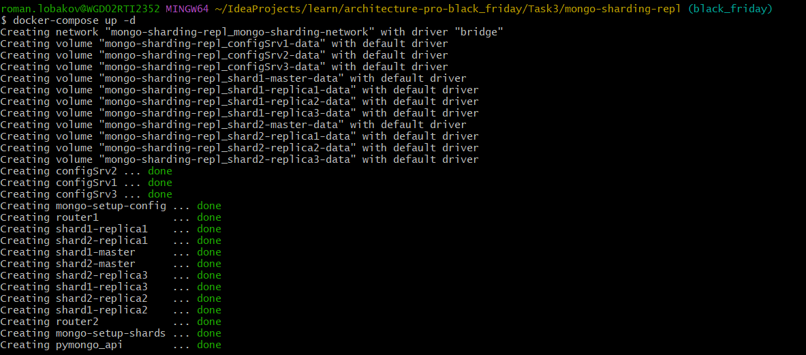
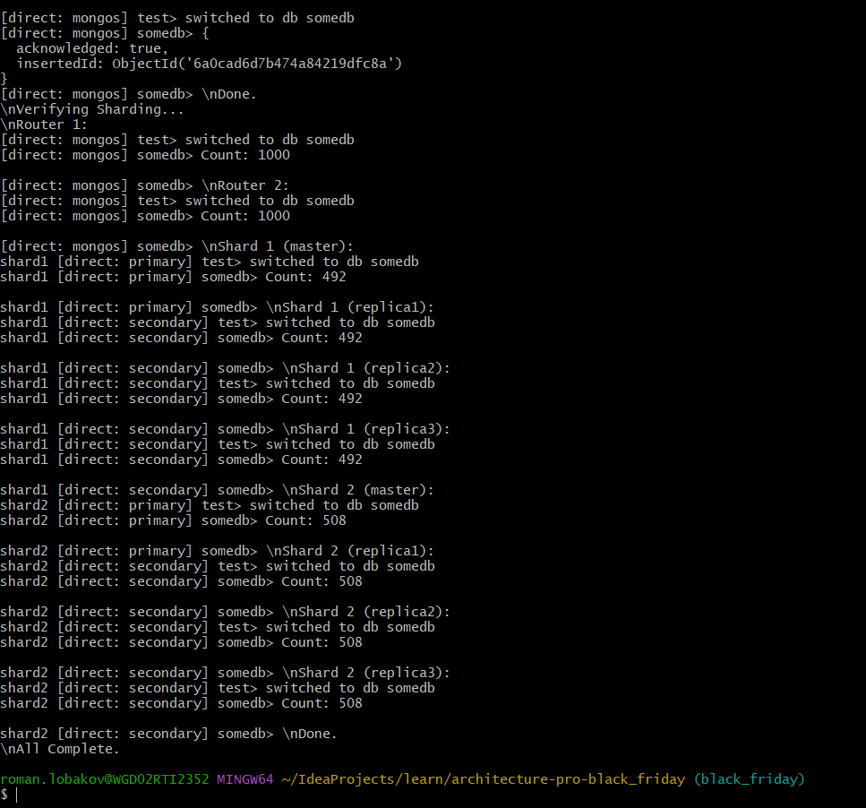

## Как запустить и проверить

Руками настраивать ничего не надо, все настройки шардинга в скриптах в директории scripts, в compose.yaml прописана настройка при помощи этих скриптов.

1. Убедитесь, что находитесь в директории architecture-pro-black-friday/Task3/mongo-sharding-repl/
2. Запустите `docker-compose up -d`
3. Дождитесь окончания сборки

4. Запустите `docker logs mongo-setup-shards`
5. Наблюдайте результат настройки

