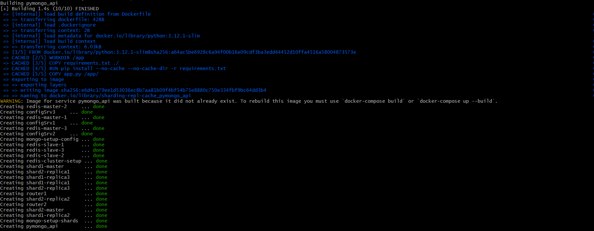
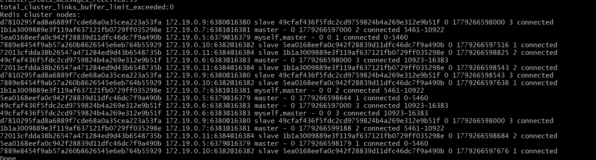
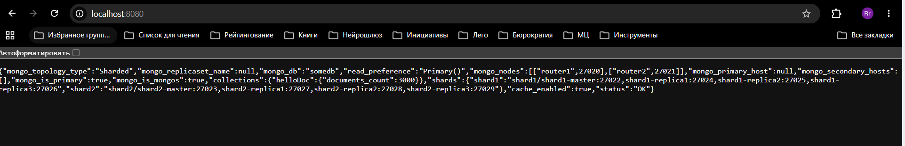
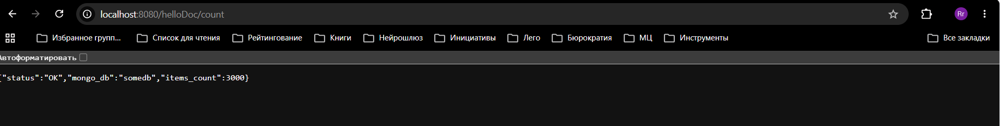
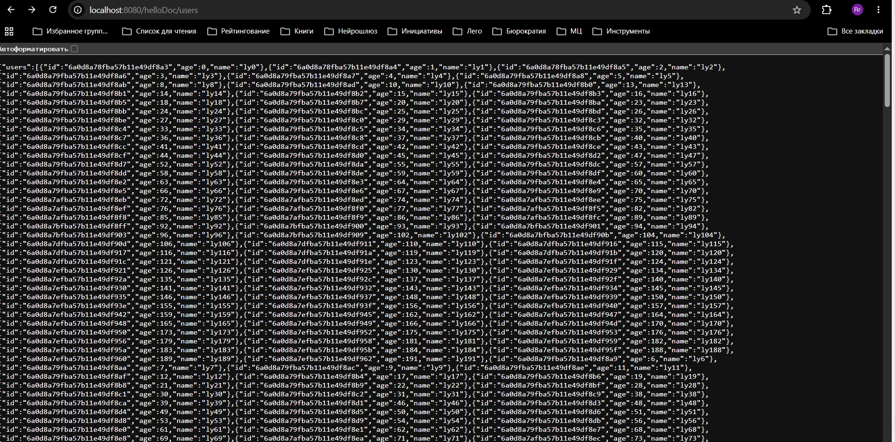

## Как запустить и проверить

**NB! Текущая версия pymongo_api не умела работать с кластером редиса, я в питоне не шарю, поэтому воспользовался ИИ чтобы подружить приклад с кластером редиса, вроде все норм, но если что не пинайте ногами.**

Руками настраивать ничего не надо, все настройки шардинга, репликации и кеширования в скриптах в директории scripts, в compose.yaml прописана настройка при помощи этих скриптов.

1. Убедитесь, что находитесь в директории architecture-pro-black-friday/Task4/sharding-repl-cache/
2. Запустите `docker-compose up -d`
3. Дождитесь окончания сборки

4. Запустите `docker logs redis-cluster-setup`
5. Наблюдайте результат настройки редис кластера

6. В браузере можно посмотреть настройки http://localhost:8080

или посчитать документы в коллекции http://localhost:8080/helloDoc/count

или получить юзеров http://localhost:8080/helloDoc/users

